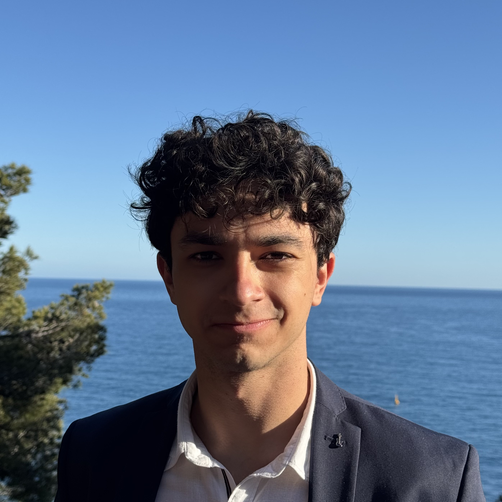
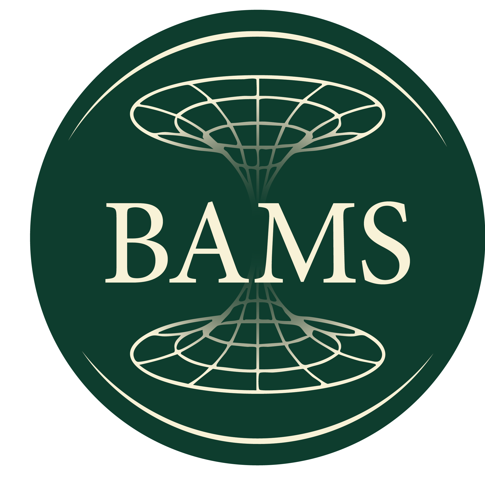

<!-- TITOLO CENTRATO E GRANDE (senza sottotitolo) -->

  <h1>Giuseppe Bassi</h1>

<!-- HERO + OVERLAY (avatar, contatti, loghi) -->

  

  

    <!-- Avatar circolare, leggermente più grande -->
    

    <!-- Contatti vicino all’icona -->
    

      <a href="mailto:giuseppe.bassi2@studbocconi.it" target="_blank" rel="noopener">Email</a>
      •
      <a href="https://www.linkedin.com/in/giuseppe-bassi/" target="_blank" rel="noopener">LinkedIn</a>
      •
      <a href="https://www.youtube.com/@bassigiuseppe" target="_blank" rel="noopener">YouTube</a>
      •
      <a href="https://www.instagram.com/bassii.giuseppe/" target="_blank" rel="noopener">Instagram</a>
    

    <!-- Loghi (più grandi), uno accanto all’altro -->
    

      
      
    

  

<!-- Sottotitolo in stile LinkedIn: subito sotto il lago, non sovrapposto -->

  Bachelor Student of Mathematical and Computing Sciences for AI at Bocconi University

<!-- CTA immediatamente sotto, senza riga di separazione -->

  <a class="md-button md-button--primary md-button--xl" href="notes/">Material</a>

---

## About this site  

I am Giuseppe Bassi, a Bachelor student in Mathematical and Computing Sciences for Artificial Intelligence at Bocconi University. My interests lie in mathematical analysis with applications to optimization, learning, and complex systems.  

This website collects my university notes and some materials from Mathematical Olympiads, with more to come as the content grows.  

If you notice mistakes or have suggestions for improvement feel free to contact me at [giuseppe.bassi2@studbocconi.it](mailto:giuseppe.bassi2@studbocconi.it).

---

## Other projects  

- [YouTube Channel](https://www.youtube.com/@bassigiuseppe): an educational YouTube channel focused on Olympiad-level mathematics (in Italian, currently inactive due to lack of time).
- [BAMS – Bocconi Student Association for Mathematical Sciences](https://mathematicalsciencesbocconi.org/): I am the founder and president of Bocconi's first math association, which aims to create a space where students can explore and develop a genuine interest in the mathematical sciences.

Background photo of Lake Garda by <a href="https://commons.wikimedia.org/wiki/User:Wolfgang_Moroder" target="_blank">Wolfgang Moroder</a>, used under CC BY-SA 3.0.

