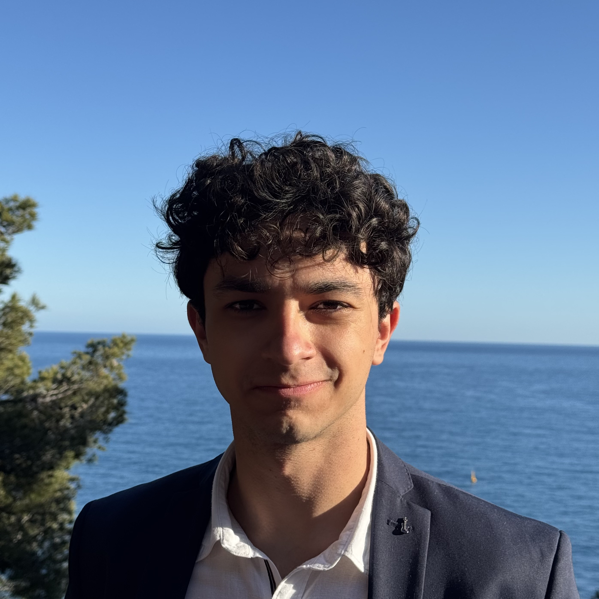
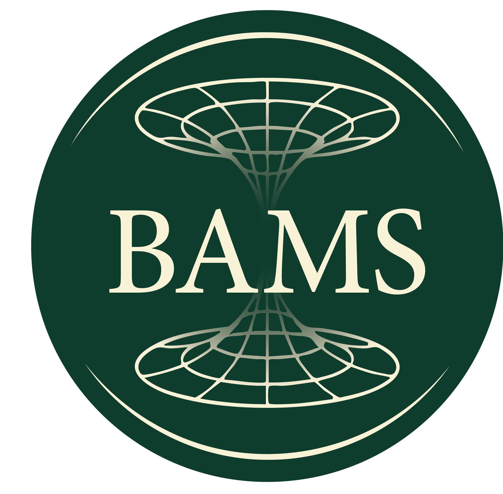

<!-- MAINTENANCE BANNER START (rimuovi questo blocco quando l'aggiornamento è completo) -->

  🚧 This site is currently being updated — please check back in a few hours.

<!-- MAINTENANCE BANNER END -->

<!-- TITOLO CENTRATO E GRANDE (senza sottotitolo) -->

  <h1>Giuseppe Bassi</h1>

<!-- HERO + OVERLAY (avatar, contatti, loghi) -->

  

  

    <!-- Avatar circolare, leggermente più grande -->
    

    <!-- Contatti vicino all'icona -->
    

      <a href="mailto:giuseppe.bassi@princeton.edu" target="_blank" rel="noopener">Email</a>
      •
      <a href="https://www.linkedin.com/in/giuseppe-bassi/" target="_blank" rel="noopener">LinkedIn</a>
      •
      <a href="https://www.youtube.com/@bassigiuseppe" target="_blank" rel="noopener">YouTube</a>
      •
      <a href="https://www.instagram.com/bassii.giuseppe/" target="_blank" rel="noopener">Instagram</a>
    

    <!-- Loghi (più grandi), uno accanto all'altro -->
    

      
      
    

  

<!-- Sottotitolo in stile LinkedIn: subito sotto il lago, non sovrapposto -->

  PhD student in Operations Research and Financial Engineering at Princeton University

<!-- CTA immediatamente sotto, senza riga di separazione -->

  <a class="md-button md-button--primary md-button--xl" href="notes/">Material</a>

---

## About this site  

I am Giuseppe Bassi, a PhD student in Operations Research and Financial Engineering at Princeton University. I graduated with a BSc in Mathematical and Computing Sciences for Artificial Intelligence from Bocconi University. I am interested in high-dimensional probability, optimization, asymptotic analysis, and the mathematical foundations of machine learning, particularly through the interplay of concentration, convex duality, and statistical physics.

This website collects my university notes and some materials from Mathematical Olympiads, with more to come as the content grows.  

If you notice mistakes or have suggestions for improvement feel free to contact me at [giuseppe.bassi@princeton.edu](mailto:giuseppe.bassi@princeton.edu).

---

## Other projects  

- [YouTube Channel](https://www.youtube.com/@bassigiuseppe): an educational YouTube channel focused on Olympiad-level mathematics (in Italian, currently inactive due to lack of time).
- [BAMS – Bocconi Student Association for Mathematical Sciences](https://mathematicalsciencesbocconi.org/): I am the founder and president of Bocconi's first math association, which aims to create a space where students can explore and develop a genuine interest in the mathematical sciences.
